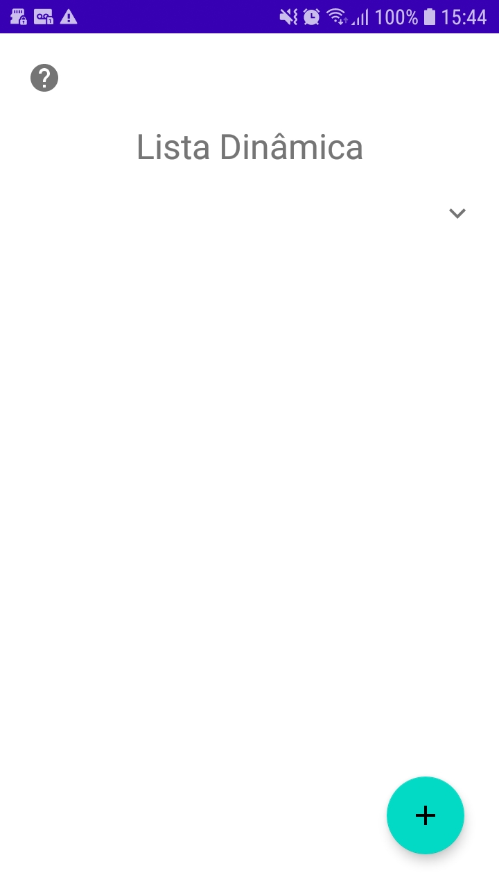
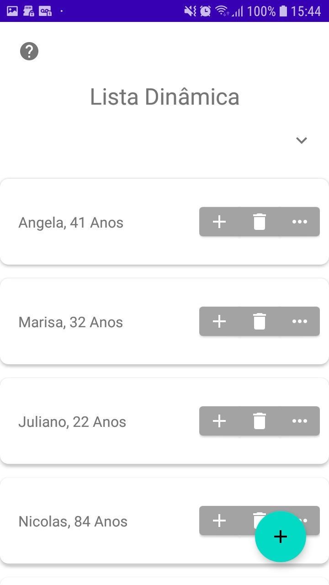
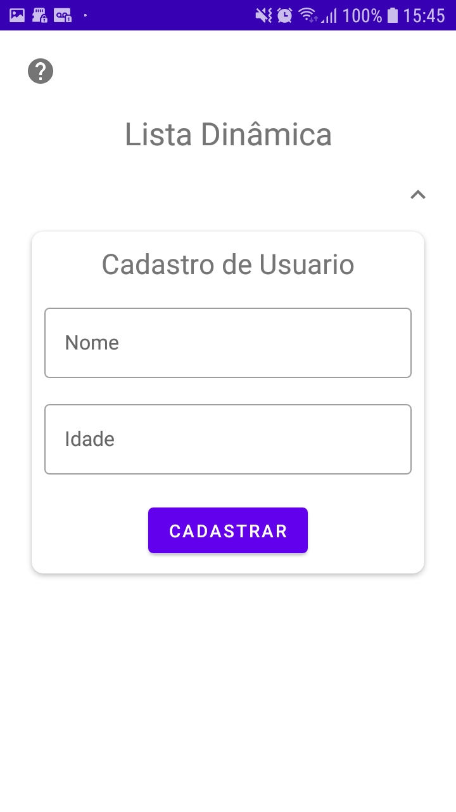
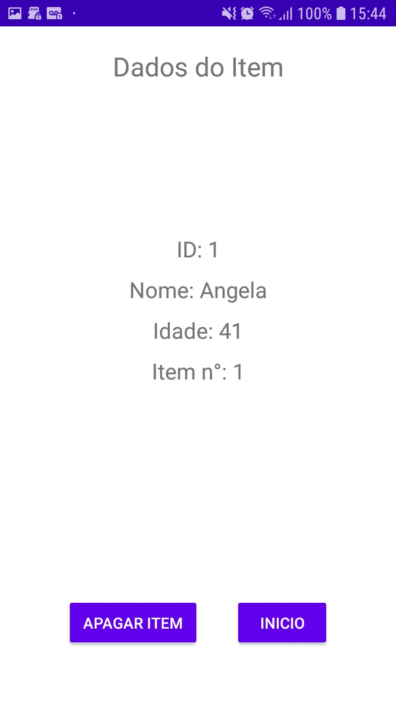
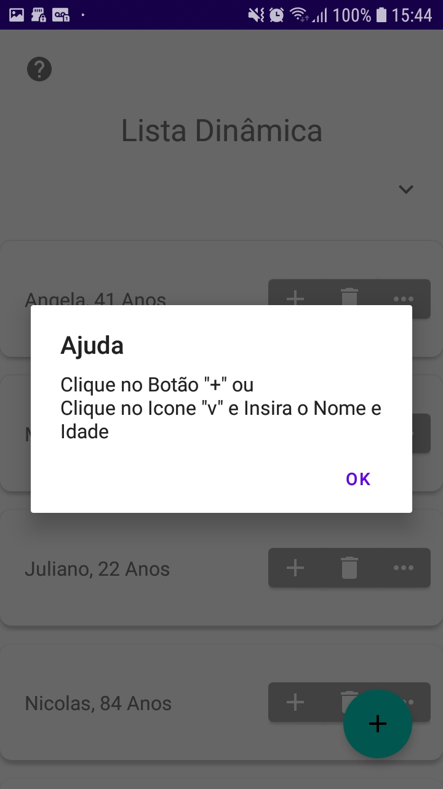

<h1 align="center" id="title">Recycler View</h1>


<h3 align="center">
    Desenvolvendo uma Aplicação com Listas Dinamicas - <a href="https://developer.android.com/guide/topics/ui/layout/recyclerview?hl=pt-br" tagert="_blank">Recycler View</a>
</h3>

<p align="center" id="icons">
  <a href="#icons">
    
  </a>
	
  <a href="https://github.com/guilhermePalma/RecyclerView">
    
  </a>
	
  <a href="https://github.com/guilhermePalma/RecyclerView/commits/main">
    
  </a>
	
  <a href="LICENSE">
   
  </a>
</p>


<p align="center">
  
	
  
	
  
	
  

  

</p>


Tabela de conteúdos
=================
<!--ts-->
 * [Sobre o projeto](#-sobre-o-projeto)
   * [Funcionalidades](#-funcionalidades)
   * [Layout](#-layout)
     * [Mobile](#mobile)
   * [Como executar o projeto](#-como-executar-o-projeto)
     * [Pré-requisitos](#pré-requisitos)
     * [Baixando o Projeto](#-baixando-o-projeto)
   * [Tecnologias](#-tecnologias)
   * [Contribuidores](#-contribuidores)
   * [Como contribuir no projeto](#-como-contribuir-no-projeto)
<!--te-->


# 💻 Sobre o projeto

**Recycler View** - Projeto desenvolvido para o Estudo do Recycler View na criação de Listas
Dinâmicas, Gerenciamento dos Cliques nela e Manipulação junto ao Banco de Dados


## 📰 Funcionalidades

- [x] A Aplicação ira exibir:
  - [x] ID
  - [x] Nome
  - [x] Idade
  - [x] Posição na Lista

- [x] Outros Recuros:
  - [X] Recycler View
  - [X] Gerenciamento de Cliques nos Itens e Botões
  - [X] Manipulação de Dados entre Activities
  - [X] Banco de Dados Interno
  - [X] Fragment
  - [X] Interfaces


## 🎨 Layout

### Mobile

**[Imagens](printscreen)** das Telas do APP


## 🚀 Como executar o projeto

### Pré-requisitos

Antes de começar, você vai precisar ter instalado em sua máquina:
- [Git](https://git-scm.com) → Atualizações e Versionamento no Codigo 
- [Android Studio](https://developer.android.com/studio/) → Editor da Google voltado ao Desenvolvimento Android

<br/>

Este Projeto é divido em 4 Principais Partes:
1. [Configurações das Telas](app/src/main/java/com/example/recyclerview/views)
2. [Layout das Telas](app/src/main/res/layout)
3. [Classe e Interface](app/src/main/java/com/example/recyclerview/model)
4. [Controladores](app/src/main/java/com/example/recyclerview/controller)


### 📥 Baixando o Projeto

```bash

# Clone este repositório
$ git clone https://github.com/GuilhermePalma/RecyclerView.git

# Acesse a pasta do projeto no terminal/cmd
$ cd RecyclerView

```


## 🛠 Tecnologias

As seguintes ferramentas foram usadas na construção do projeto:
-   **[Java](https://developer.android.com/docs)**


#### **Utilitários**
-   Documentação Android: → Extenção: **[RecyclerView](https://developer.android.com/guide/topics/ui/layout/recyclerview?hl=pt-br)**
-   Documentação Android: → Extenção: **[SQLite](https://developer.android.com/training/data-storage/sqlite?hl=pt-br)**
-   Documentação Android: → Extenção: **[Random](https://developer.android.com/reference/java/util/Random)**
-   Documentação Android: → Extenção: **[Toast](https://developer.android.com/guide/topics/ui/notifiers/toasts)**


## 👨‍💻 Contribuidores

💜 Desenvolvedores que contruiram o Aplicativo :)

<table>
  <tr>
    <td align="center"><a href="https://github.com/guilhermepalma"><br /><sub><b>Guilherme Palma</b></sub></a><br /><a href="https://github.com/guilhermepalma" title="Github">🚀</a></td>
  </tr>
</table>


---


## 💪 Como contribuir no projeto

1. Faça um **fork** do projeto.
2. Crie uma nova branch com as suas alterações: `git checkout -b my-feature`
3. Salve as alterações e crie uma mensagem de commit contando o que você fez: `git commit -m "feature: My new feature"`
4. Envie as suas alterações: `git push origin my-feature`

---
